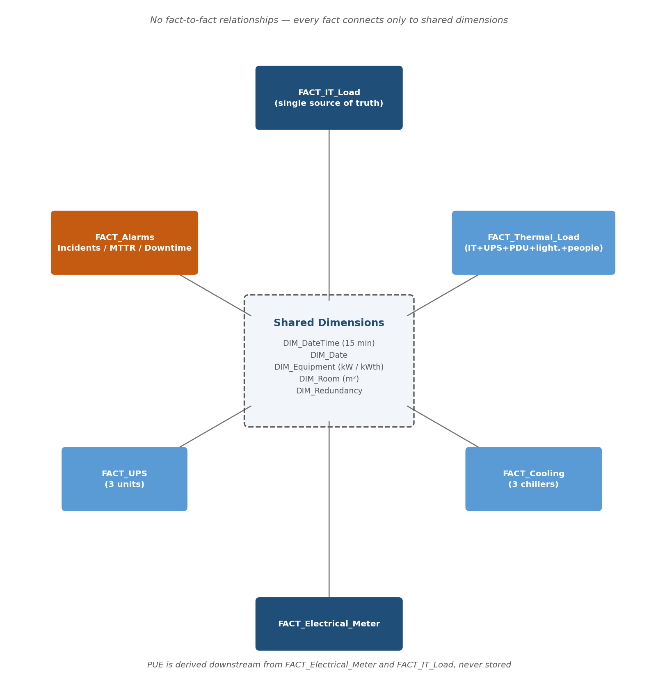
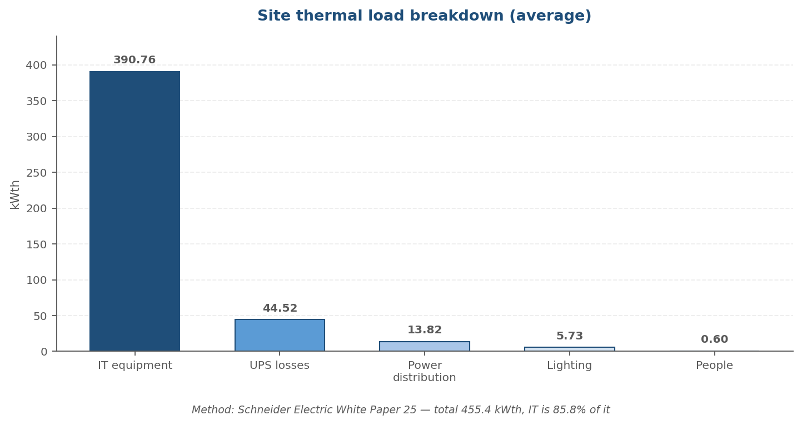
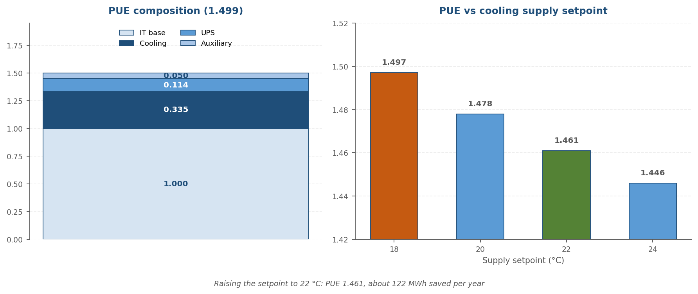
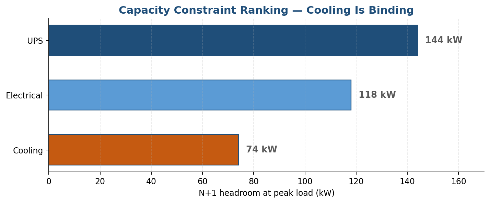
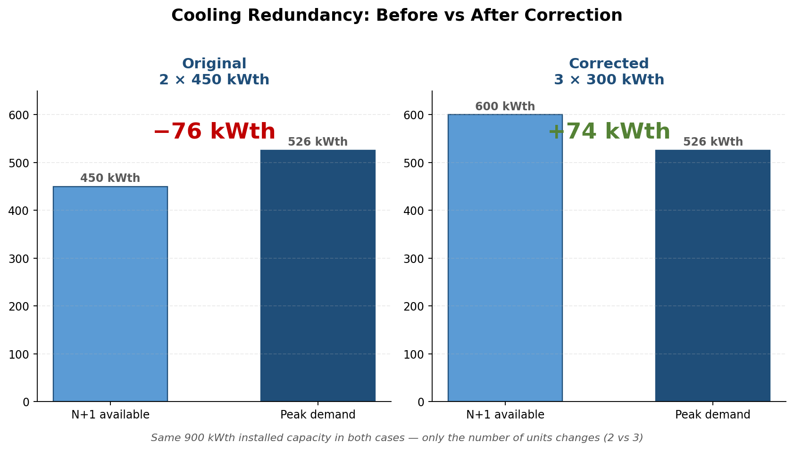
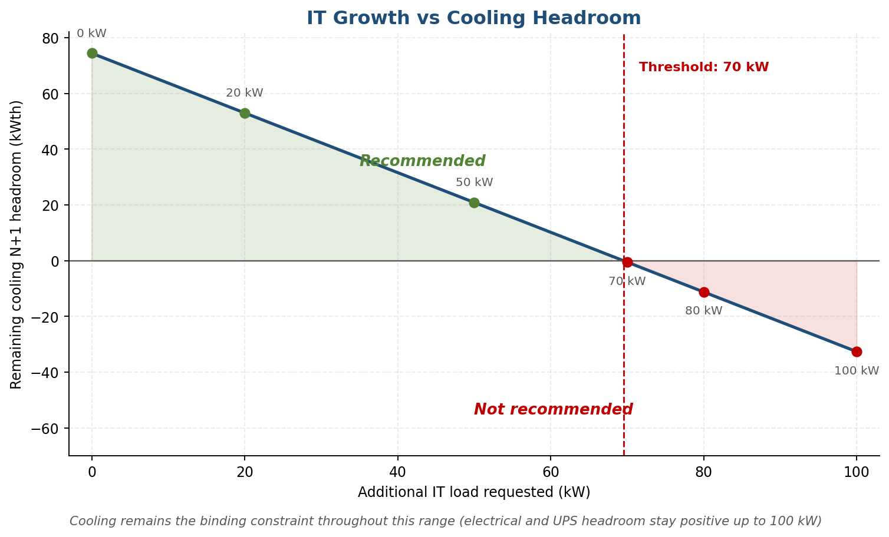
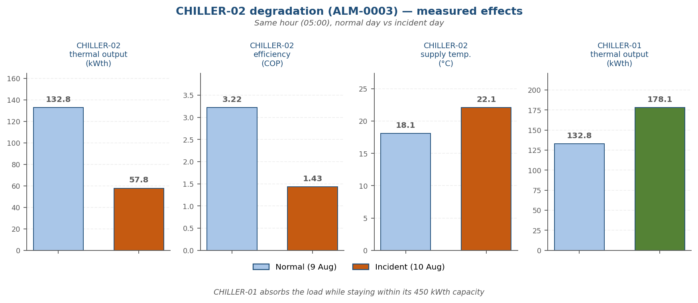

# Data Center Capacity & Energy Analytics

**Tier III–aligned simulated architecture for energy efficiency, infrastructure resilience, and capacity planning.**

> **Disclaimer:** All operational data in this repository are synthetic and generated for analytical demonstration. No confidential operational data are used.

---

## Table of contents

1. [Executive summary](#executive-summary)
2. [Business questions](#business-questions)
3. [Architecture](#architecture)
4. [Data model](#data-model)
5. [Simulation methodology](#simulation-methodology)
6. [Key metrics](#key-metrics)
7. [The main finding: cooling redundancy, before and after](#the-main-finding-cooling-redundancy-before-and-after)
8. [Capacity planning & decisions](#capacity-planning--decisions)
9. [Reliability & data governance](#reliability--data-governance)
10. [Incident deep dive](#incident-deep-dive)
11. [What this model does NOT prove](#what-this-model-does-not-prove)
12. [Sample data & sources](#sample-data--sources)

---

## Executive summary

This project simulates 28 days of operation for a Tier III–aligned data center to answer one recurring operational question: **how much additional IT load can this site safely absorb without breaking N+1 redundancy?** Every part of this repository — the star schema, the thermal methodology, the incident simulation — exists to answer that question with a number, not an opinion.

The headline result: the site's original cooling design (2 chillers of 450 kWth) looked comfortably sized on paper but **did not actually hold N+1 redundancy** at peak load. Re-splitting the same installed capacity into 3 chillers of 300 kWth fixed this at zero additional cost. That correction — and its knock-on effects on PUE, growth capacity, and decision-making — is the throughline of everything below.

> **North Star Metric: Cooling N+1 Headroom at Peak**
> This is the single figure the rest of the analysis revolves around — it's what failed in the original design, what the correction restored, and what ultimately caps how much IT growth the site can accept.
>
> | | Original design | Corrected design |
> |---|---|---|
> | Cooling N+1 headroom at peak | **−76 kWth** | **+74 kWth** |

---

## Business questions

| # | Question | Answer |
|---|---|---|
| Energy | How efficient is the facility? | PUE **1.50** |
| Capacity | How much capacity remains? | Cooling is limiting, **~74 kWth** headroom at peak |
| Resilience | Can we lose one critical component? | Yes — N+1 maintained on all three pillars |
| Reliability | Did the simulated incidents affect IT service? | No — **100% IT service availability** |
| Growth | Can we add more IT load? | **~70 kW recommended**, ~80 kW not recommended |
| Optimization | Where should we optimize? | Cooling setpoint, but only *after* protecting the thermal N+1 margin |
| Data quality | Can we trust the data? | Duplicates are detected and quantified; sources reconcile within noise |

---

## Architecture

Strict star schema. Every fact table carries a physically independent measurement — no fact-to-fact relationships, no value derived from another table's formula.



| Table | Grain | Rows | Role |
|---|---|---|---|
| `FACT_IT_Load` | Timestamp × Room | 5,376 | Single source of truth for IT load |
| `FACT_UPS` | Timestamp × UPS | 8,064 | 3 UPS units, states, losses |
| `FACT_Thermal_Load` | Timestamp | 2,688 | Thermal load broken down by source |
| `FACT_Cooling` | Timestamp × Chiller | 8,064 | 3 chillers, thermal + electrical measurements |
| `FACT_Electrical_Meter` | Timestamp | 2,688 | Facility power at the meter |
| `FACT_Alarms` | Event | 14 | Incidents, planned maintenance, downtime |

---

## Data model

`DIM_Scenario` is the planning layer used for capacity projections in [§8](#capacity-planning--decisions):

```
Scenario_ID   Additional_IT_kW
S00           0
S01           20
S02           50
S03           70
S04           80
S05           100
```

Every number elsewhere in this document is either measured by the simulation, fixed by design, or an explicit assumption — none are presented as manufacturer data.

| Parameter | Value | Type |
|---|---|---|
| Simulation period | 28 days, 15-min intervals | Model design |
| Peak IT load | 456 kW | Simulated |
| Floor area / headcount | 400 m² / 6 people | Assumption |
| UPS no-load loss | 8 kW/unit | Assumption |
| COP (nominal / variation) | 3.5 ± 0.3 | Simulation assumption — a deliberate day-to-day drift model, not a real chiller's datasheet curve |
| IT heat conversion | 1:1 | Schneider WP25 methodology |
| Redundancy topology | N+1 | Architecture |
| Generator telemetry | Not modelled | Limitation |

---

## Simulation methodology

Thermal load follows the Schneider Electric White Paper 25 methodology: IT electrical power converts 1:1 to heat, plus UPS losses, distribution losses, lighting, and occupants. The Schneider method was used as an **additional sizing reference** for validating cooling capacity (§7) — not as a claim about any specific equipment's real-world behaviour.



Data generation uses no non-deterministic random function: noise is a trigonometric hash indexed on timestamp and equipment ID, so every model refresh produces identical results — a reproducibility requirement, not a cosmetic detail.

---

## Key metrics

### Energy (28-day totals)

| KPI | Value |
|---|---|
| IT Energy | 262.8 MWh |
| Facility Energy | 393.8 MWh |
| Cooling Energy | 88.0 MWh |
| PUE | **1.50** |
| Cooling Energy / IT Energy | 0.335 |



Raising the cooling supply setpoint from 18°C to 22°C would bring PUE to 1.46 — a **simulated annualized saving under the model's COP sensitivity assumption (+3% per °C)**, not a measured result, and only worth pursuing *after* the capacity fix in §7 (a higher setpoint eats into the thermal margin needed during a failure).

### Capacity

| KPI | Value |
|---|---|
| IT Peak | 456 kW |
| Electrical N+1 Headroom | 118 kW |
| UPS N+1 Headroom | 144 kW |
| Cooling N+1 Headroom | 74 kWth |
| Binding Constraint | **Cooling** |



---

## The main finding: cooling redundancy, before and after

**Design challenge.** With 2 chillers of 450 kWth, installed capacity (900 kWth) looked comfortably above peak thermal load (526 kWth).

**Analysis.** Redundancy doesn't depend on total capacity — it depends on what's left when one unit fails. Split across only two units, losing one costs 50% of capacity, leaving 450 kWth against a 526 kWth requirement.

**Correction.** The same 900 kWth, split into 3 units of 300 kWth instead of 2 of 450 kWth. A single-unit failure now costs 33%, not 50%.



| Option | Installed | Available N+1 | Headroom at peak |
|---|---|---|---|
| Original: 2 × 450 kWth | 900 kWth | 450 kWth | **−76 kWth** |
| **Corrected: 3 × 300 kWth** | **900 kWth (unchanged)** | **600 kWth** | **+74 kWth** |

Zero additional installed capacity. This is the architecture applied in the final model — every metric elsewhere in this document reflects the corrected state.

---

## Capacity planning & decisions

Using the `DIM_Scenario` table (§4), remaining cooling headroom is projected against additional IT load:



Cooling crosses zero headroom at **~70 kW** of additional load and stays the binding constraint throughout — electrical (118 kW) and UPS (144 kW) headroom remain positive even at 100 kW added.

| Decision | Verdict | Basis |
|---|---|---|
| Maintain N+1 UPS | ACCEPT | 144 kW margin |
| Maintain N+1 cooling | ACCEPT | 74 kW margin |
| Add 50 kW IT | ACCEPT | All margins positive |
| Add 70 kW IT | ACCEPT / MONITOR | Cooling near limit |
| Add 80 kW IT | NOT RECOMMENDED | Cooling constraint breached |
| Remove one UPS (2 instead of 3) | REJECT | Resilience lost for a 0.02 PUE gain |
| Raise cooling setpoint (18°C→22°C) | CONDITIONAL | Energy gain vs. thermal margin — sequence after the capacity fix above |

---

## Reliability & data governance

100% IT service availability over 28 days is a **simulation result**, not proof the site meets the Uptime Institute's Tier III annual target (99.982%, 1.6h/year) — the window is too short to extrapolate, and Tier III status can only be conferred by an Uptime Institute audit of a real facility. This project does not claim certification.

| Reliability | Value | Note |
|---|---|---|
| Equipment Availability | 99.335% | Frequency of alarms affecting a component |
| **IT Service Availability** | **100.000%** | No actual interruption over the window |
| Downtime (merged) | 4.47 h | Overlapping alarms merged, not double-counted |
| MTTR / MTBF | ~2.8 h / ~14 days | Based on 2 observed failures — illustrative, not statistically robust |
| Incidents / Service-impacting | 13 unique / 2 | Both resolved, no IT outage |

Concurrent maintainability is demonstrated on **all three infrastructure pillars**, each with zero IT impact: `ALM-0006` (UPS maintenance), `ALM-0012` (chiller maintenance), `ALM-0013` (transformer maintenance).

**Data quality:** the `ALM-0007` duplicate is kept intentionally rather than silently removed, to demonstrate a deduplication calculation (7.1%) instead of hiding the defect. The independent electrical meter reading reconciles with the sum of its component sub-systems (IT + cooling + UPS losses + auxiliary) within noise (<1%) — a deliberate design choice that lets the model surface this kind of cross-source check. `ALM-0008` (power factor dropping below 0.95 during peak load, from cooling motor inductive load) is the basis for recommending an automatic capacitor bank to avoid utility penalties and free up transformer capacity.

---

## Incident deep dive

A chiller degradation incident (`ALM-0003`) is embedded in the data, with effects consistent across every table.



With three chillers, compensation is shared between the two healthy units (178 and 183 kWth each) instead of falling entirely on one, as it would under the original two-chiller design.

**Thermal grace period:** the degradation alarm fires at 03:22; the room temperature alarm doesn't trigger until 04:05 — a 43-minute window driven by thermal inertia and redundant compensation, during which an operations team can react before any hardware risk.

---

## What this model does NOT prove

This simulation does **not**:

- Certify Tier III compliance
- Predict real equipment performance
- Replace a detailed mechanical/electrical engineering study
- Represent the configuration of any existing data center

Every figure here is either a direct simulation output or an explicitly labelled assumption — where a result depends on one (COP sensitivity, floor area, headcount), that dependency is stated next to the number, not buried in a footnote.

---

## Sample data & sources

Full 28-day tables aren't included here (5,000–8,000 rows each). `data/` contains a **2-day illustrative extract** (9–10 August: one normal day, one incident day) plus the complete 14-row alarm log — full dataset and the Power BI model available on request.

| File | Rows | Content |
|---|---|---|
| `fact_it_load_sample.csv` | 384 | 2 rooms, 2 days |
| `fact_ups_sample.csv` | 576 | 3 UPS units, 2 days |
| `fact_cooling_sample.csv` | 576 | 3 chillers, includes the live incident |
| `fact_thermal_load_sample.csv` | 192 | Full thermal breakdown, 2 days |
| `fact_electrical_meter_sample.csv` | 192 | Site meter, 2 days |
| `fact_alarms_full.csv` | 14 | Complete alarm log |

**Sources:**
- Schneider Electric, Data Center Science Center — *White Paper 25: Calculating Total Cooling Requirements for Data Centers* (Neil Rasmussen)
- Schneider Electric, Data Center Science Center — *White Paper 3: Calculating Total Power Requirements for Data Centers* (Richard L. Sawyer)
- Uptime Institute — Tier III criteria (N+1 redundancy, concurrent maintainability, 99.982% availability target)

All operational data, capacities, and incidents in this project are simulated and calibrated against these public references. They do not represent any real data center's actual configuration.
